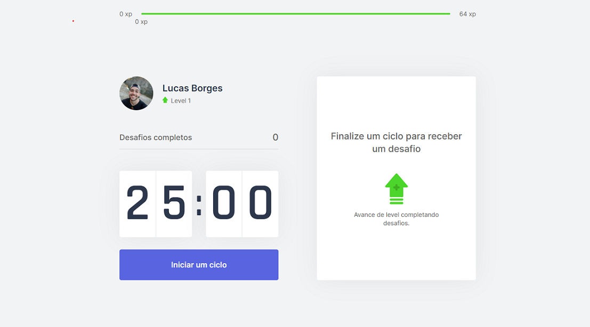

<p align="center">
  
</p>

<h1 align="center">MoveIt - NLW #04</h1>
<p align="center">
<a href="#books-descrição-do-projeto">Descrição do Projeto</a>
|
<a href="#computer-tecnologias">Tecnologias</a>
|
<a href="#rocket-execução">Execução</a>
|
<a href="#cyclone-deploy">Deploy</a>
|
<a href="#camera-tela-principal">Tela Principal</a>
</p>

## :books: Descrição do Projeto

  O MoveIt se consiste em um sistema de interface interativa com o usuário, que visa ampliar a produtividade e a disciplina em um contexto de produção pessoal, unindo práticas saudáveis durante ciclos de trabalho.
  
  Nesse sentido, a aplicação fornece mecanismos de intervalos de trabalho que, ao terminados, sugerem ao usuário exercícios simples para o corpo e olhos, evitando lesões e dores futuras, concedendo ao usuário experiências (XP) em função da conclusão dos exercícios, fazendo com que o mesmo suba de nível ao decorrer dos ciclos.

## :computer: Tecnologias

A stack utilizada para criar o MoveIt está em constante atualização. Até o presente momento, as seguintes tecnologias foram escolhidas:

- React.JS
- Next.JS
- TypeScript
- HTML 5, CSS 3

## :rocket: Execução

- ### **Pré-requisitos**

  - É necessário ter instalado em sua máquina o **[Node.js](https://nodejs.org/en/)**. A versão **12.19.0** é recomendada.
  - É necessário a instalação das bibliotecas **[React.js](https://pt-br.reactjs.org/)** e **[Next.js](https://nextjs.org/)**, nas versões mais recentes.
  - É **necessário** ter o **[Git](https://git-scm.com/)** (v2.29.0 for Windows) instalado e configurado no computador.
  - Para a configuração e instalação usaremos um gerenciador de pacotes. Recomendamos o uso do **[Yarn](https://yarnpkg.com/)** (v1.22.5).

1. Clone o repositório

```sh
  $ git clone https://github.com/luqiborges/moveit-next.git
```

2. Execute a aplicação (na ordem a seguir)

```sh
  $ cd moveit-next
  $ yarn
  $ yarn dev
```

3. Abra o navegador e acesse a aplicação em:
```sh
  localhost:3000
```

## :cyclone: Deploy

  O deploy da aplicação foi realizado através da plataforma **[Vercel](https://vercel.com)**, permitindo acesso à aplicação através do endereço:
  ```sh
    https://moveit-nlw4-luqiborges.vercel.app/
```

## :camera: Tela Principal

<p align="center">
  
</p>
---

> O MoveIt foi construído durante a Next Level Week #04, promovida pela Rocketseat em 2021.
